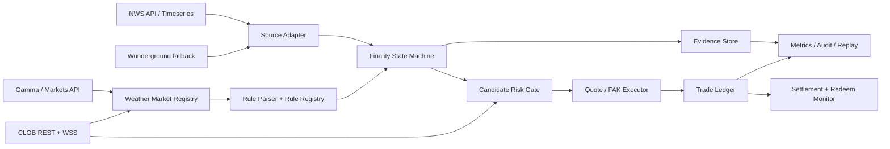
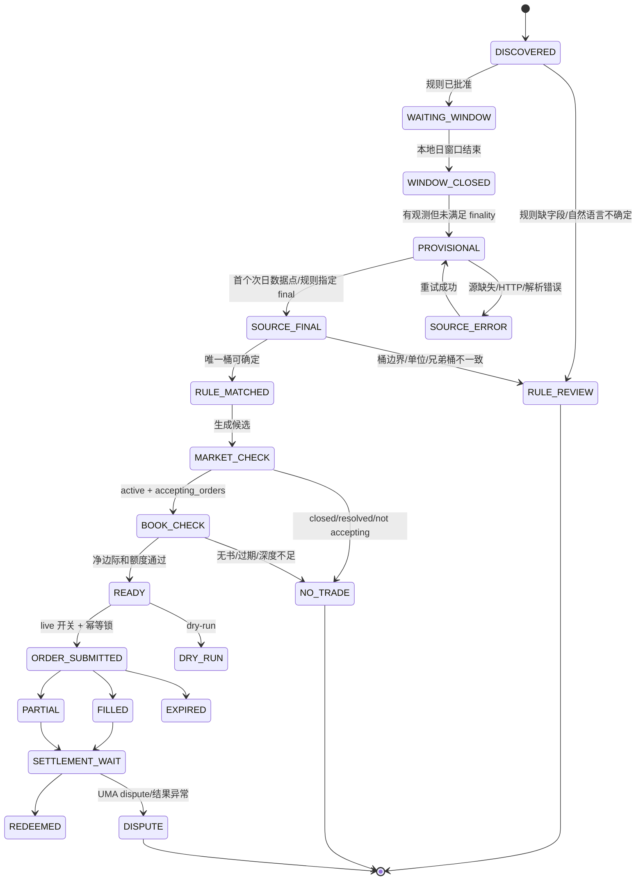

# 01. 总体架构与运行边界

## 1.1 设计原则

1. **事实、规则、交易三层分离**：数据源只回答“观测值是什么”，规则解析器只回答“该值落在哪个桶”，执行器只回答“当前是否值得且允许下单”。
2. **源证据优先于盘口**：CLOB 价格只能衡量机会，不能证明天气结果。
3. **版本化、可重放**：市场规则、源响应、聚合结果和交易决策都必须可 hash、可回放。
4. **默认 fail closed**：缺字段、延迟、修订、站点不一致、市场状态不确定时停止交易。
5. **策略域隔离**：`weather_*` 不复用足球的比分事件和体育专用常量，但可以共享底层 CLOB、账本和审计设施。

## 1.2 逻辑架构



### 组件职责

| 组件 | 责任 | 明确不负责 |
|---|---|---|
| `weather_market_registry` | 同步 Gamma 市场元数据、事件兄弟桶、生命周期与 fee/tick | 不判定天气结果 |
| `weather_rule_parser` | 从规则原文生成结构化站点、时区、日期、指标、桶映射；生成 review | 不猜测缺失字段 |
| `weather_source_adapter` | 拉取 NWS/WU，规范化观测，识别 provisional/final | 不读取盘口，不下单 |
| `weather_finality` | 合并规则和源数据，输出唯一 `settlement_side` | 不用市场价格推断结果 |
| `weather_quote` | 读取 asks、walking VWAP、计算实际 fee 与净边际 | 不改变 finality 结论 |
| `weather_executor` | 幂等提交 FAK、跟踪 fills、撤销/重试 | 不在 `REVIEW_REQUIRED` 下单 |
| `weather_ledger` | 事件、订单、成交、持仓、redeem、PnL 关联 | 不依赖内存状态作为唯一账本 |
| `replay` | 用原始证据和历史书重放决策 | 不连接 live order endpoint |

## 1.3 进程与部署建议

POC 可先在现有 `run_main` 所在主机上以独立进程运行，生产再拆容器/服务：

```text
weather-discovery       每 3h 全量；临近窗口每 1–5min
weather-source-poller   每 1–5min；窗口后提高频率，直到 final/timeout
weather-finality         事件驱动 + 周期重算
weather-quote             仅在候选门通过后读书/下单
weather-settlement        每 1–5min 同步 market status、redeem
weather-replay            离线 CLI，与 live 凭证隔离
```

建议所有组件共享 PostgreSQL/SQLite（POC 可 SQLite WAL）和对象存储/本地压缩文件。原始 source payload 不放在只保留最新值的表里，必须按 hash 留存。

## 1.4 状态机



状态必须单向推进，重新拉到旧 source payload 不能把 `SOURCE_FINAL` 降级为 `PROVISIONAL`；若发现源修订，创建新 `evidence_version` 和 `rule_version`，由风控决定是否冻结。

## 1.5 关键时序

```text
Gamma sync ──> 识别 weather event 及 11 个 sibling markets
                    │
                    └─> 规则解析/人工批准 ──> source poll
                                              │
NWS/WU observation <──────────────────────────┘
                                              │
                         finality + bucket map
                                              │
                      market lifecycle refresh
                                              │
                CLOB /books 批量拉目标 token asks
                                              │
                         VWAP + fee + limits
                                              │
               dry-run candidate / FAK order
                                              │
                   fills -> ledger -> redeem
```

## 1.6 与 `dqdhook` 的接入点

- 复用 HTTP proxy、Gamma client、CLOB client、订单签名/发送封装，但由 `weather_quote` 传入 Weather 的 fee/tick/min size。
- 复用 finality scanner 的 JSONL/evidence hash 和 `manual_approval` 机制；不要把天气规则塞入 `match-bridge`。
- 新增 `strategy_domain=weather`、`event_group_id`、`rule_version`、`evidence_hash` 字段，确保报表能够和足球仓位区分。
- 现有 `flag_misprice` 的 `SPORTS_TAKER_FEE_RATE=0.05` 只作为足球默认；天气必须先调用市场费率接口，再计算。

